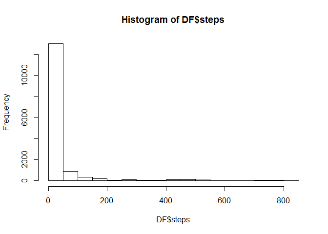
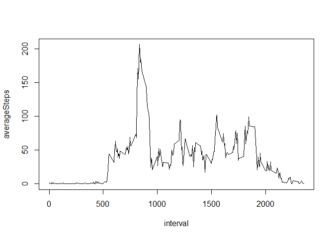
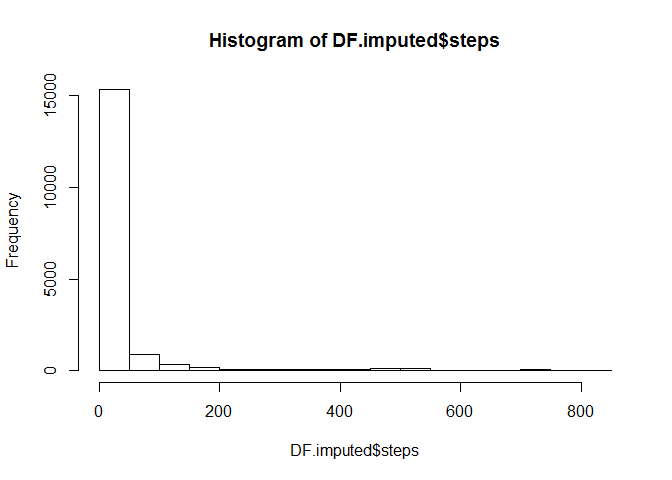
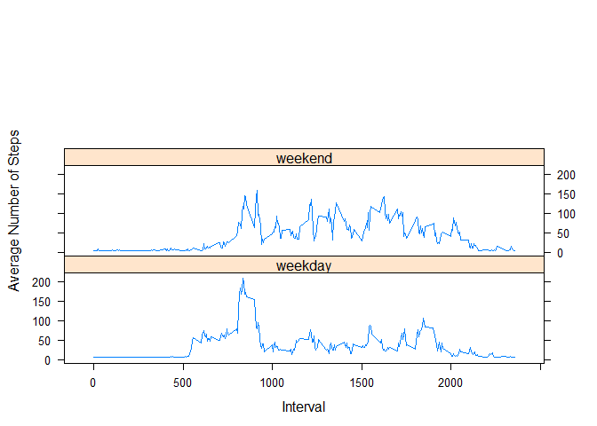

# Reproducible Research: Peer Assessment 1

## Loading and preprocessing the data


```r
setwd("C:/Users/SSW/Documents/GitHub/RepData_PeerAssessment1")
DF<-as.data.frame(read.csv(unz("activity.zip", "activity.csv")))
```

## What is mean total number of steps taken per day?


```r
library(dplyr)
```

```
## 
## Attaching package: 'dplyr'
## 
## The following object is masked from 'package:stats':
## 
##     filter
## 
## The following objects are masked from 'package:base':
## 
##     intersect, setdiff, setequal, union
```

```r
stepsEachDay<- DF%>%
    group_by(date) %>%
    summarise(totalSteps = sum(steps))

stepSum<-sum(stepsEachDay$totalSteps, na.rm=TRUE)

hist(DF$steps)
```

 

```r
meanSteps<-mean(DF$steps, na.rm=TRUE)
medianSteps<-median(DF$steps, na.rm=TRUE)
```

The mean total steps taken per day was 37.38, and the median number of daily steps was 0.


## What is the average daily activity pattern?


```r
library(dplyr)

steps.plot<-DF%>%
    group_by(interval) %>%
    summarise(averageSteps = mean(steps, na.rm=TRUE))

plot(steps.plot, type = "l")
```

 

```r
max.steps<-filter(steps.plot, averageSteps==max(averageSteps))
```


The time interval of 835 had, on average, the higest number of steps during the day.


## Imputing missing values


```r
missing<-filter(DF, is.na(steps))

#replace NAs with mean value
DF.imputed<-mutate(DF, steps=ifelse(is.na(steps), mean(DF$steps, na.rm=TRUE), steps))

meanImputed<-mean(DF.imputed$steps)
medianImputed<-median(DF.imputed$steps)
```

There are a total of 2304 missing values in the data set. 


After imputing the the mean value of 37.3825996 for all missing steps values in the dataset, the mean is 37.3825996 and the median is 0.  Using the pre-imputation mean to replace missing values did not change the mean and median values for the steps variable.  


```r
hist(DF.imputed$steps)
```

 

```r
DF.imputed$date<-as.Date(DF.imputed$date)

stepsEachDay.imputed<- DF.imputed%>%
    group_by(date) %>%
    summarise(totalSteps = sum(steps))

options(scipen = 10, digits = 2)
stepSumImputed<-round(sum(stepsEachDay.imputed$totalSteps), digits=2)
```

The imputation raises the estimate of total number of steps from 570608 to 656737.51 an increase of 86129.51.
 

## Are there differences in activity patterns between weekdays and weekends?


```r
library(lattice)

DF.Days<-DF.imputed%>%
  mutate(day=weekdays(date))%>%
  mutate(weekday=ifelse(day=="Saturday" | day=="Sunday", "weekend", "weekday"))%>%
  select(-day)

DF.Weekend<-filter(DF.Days, weekday=="weekend")
DF.Weekday<-filter(DF.Days, weekday=="weekday")

steps.Weekend<-DF.Weekend%>%
    group_by(interval) %>%
    summarise(averageSteps = mean(steps, na.rm=TRUE))%>%
    mutate(weekday="weekend")

steps.Weekday<-DF.Weekday%>%
    group_by(interval) %>%
    summarise(averageSteps = mean(steps, na.rm=TRUE))%>%
    mutate(weekday="weekday")

Weekday.Combined<-rbind(steps.Weekend, steps.Weekday)

xyplot(averageSteps~interval|weekday, data=Weekday.Combined, type = "l",  layout=(c(1,3)), ylab="Average Number of Steps", xlab="Interval")
```

 
